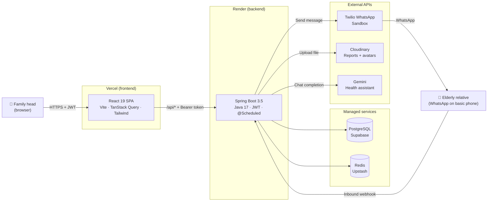
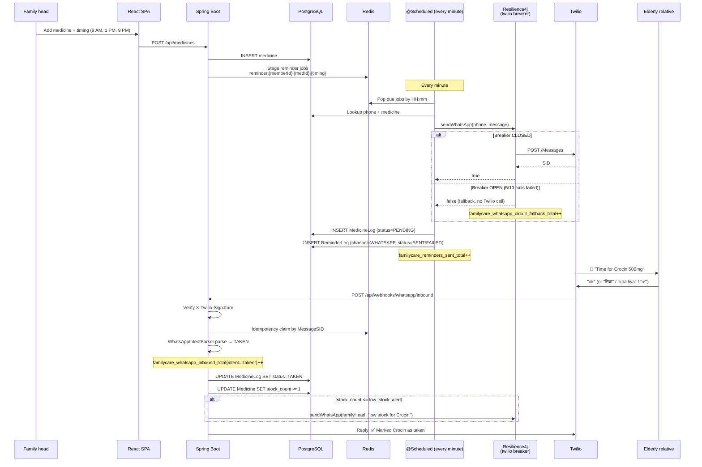
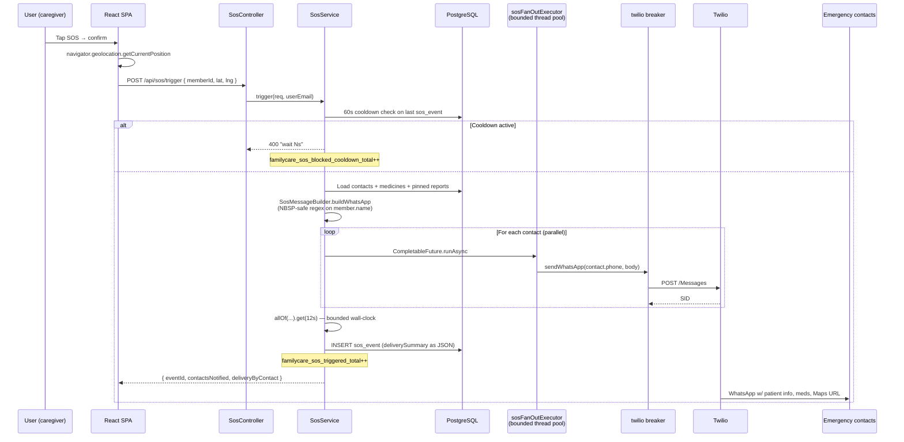
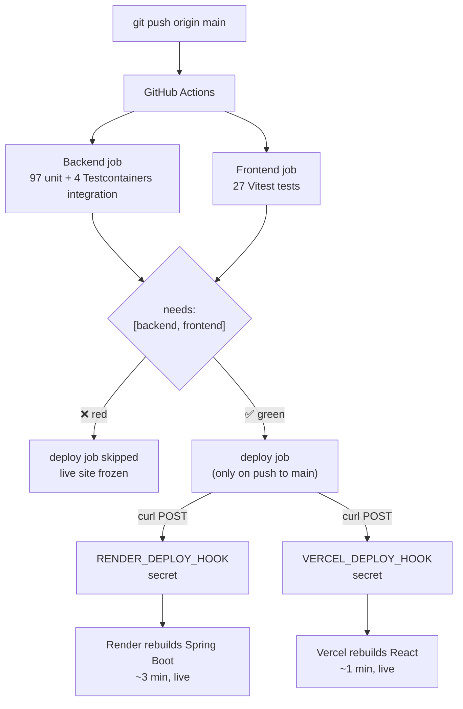
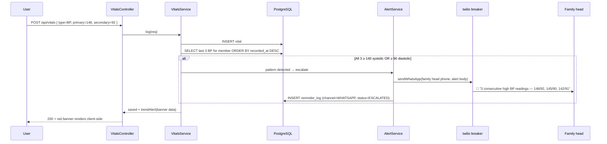

<div align="center">


<br/>

# **FamilyCare** — _the elderly parent never installs a thing._

### **A family-first health management app for India.**
The tech-savvy daughter sets up medicines, vitals, and emergency contacts on a web dashboard.
Her elderly mother gets WhatsApp reminders on her existing phone. **No app. No login. No friction.**

<br/>

[](https://familycare-gamma.vercel.app)
[](https://familycare.onrender.com/swagger-ui.html)
[](https://familycare.onrender.com/api/health)

<br/>

[](https://github.com/patelkarma/familycare/actions)
[](https://github.com/patelkarma/familycare/actions)
[](https://github.com/patelkarma/familycare/blob/main/.github/workflows/ci.yml)
[](https://uptimerobot.com)
[](https://familycare.onrender.com/actuator/prometheus)
[](https://resilience4j.readme.io/)


</div>

---

## 🧭 The problem

In India, ~138 million people are aged 60+. The people *managing* their daily health are usually their adult children — who live in a different city, work different hours, and check WhatsApp 50× a day.

**Every existing health app assumes the patient installs it.** The patient is 72. The patient does not install apps.

FamilyCare flips it: the **dashboard is for the caregiver**. The reminders go to **WhatsApp** on the parent's basic phone. Reply *"ok"*, *"haan"*, or *"✅"* and the dose is marked taken. Zero install on the device that matters most.

> ⚡ **No cold-start wait.** Render's free tier sleeps after 15 min idle. UptimeRobot pings `/api/health` every 5 min so the dyno stays warm — the live demo opens instantly. Reasoning in [ADR-003](docs/DECISIONS.md#adr-003-render-free-tier-despite-cold-starts).

---

## 🚀 See it in 60 seconds

```text
1. Open https://familycare-gamma.vercel.app and click "Try the demo"
   (or register your own account — under 30s, no email verification)
2. The dashboard lands on a pre-seeded family with 3 members, 8 medicines,
   and 14 days of vitals so the AI cards (alerts, dose progress, vitals
   tile) are populated immediately
3. Click any member → see their medicines, today's dose timeline, vitals
   chart with the threshold line, and emergency contacts
4. Click "Scan prescription" → upload a real Indian prescription photo →
   watch Tesseract.js + the dictionary fill out 3-4 medicine rows with
   confidence badges. Confirm to add them.
5. Switch the language picker to हिन्दी / ગુજરાતી / தமிழ் — sidebar,
   alerts, dose counts (with correct plurals), and dates all flip
6. Trigger SOS for any member → WhatsApp lands with patient info,
   medication list, and a clickable Google Maps link
```

> 💡 **Want to see the WhatsApp side?** Connect the Twilio sandbox by sending `join degree-idea` to `+1 415 523 8886`. Then add your number to a member's phone field — the next reminder lands on your real WhatsApp. Reply `ok`, `लिया`, `kha liya`, or `✅` and the dose flips to TAKEN.

---

## 📸 What it actually looks like

<table>
  <tr>
    <td width="50%"></td>
    <td width="50%"></td>
  </tr>
  <tr>
    <td><b>One dashboard, every member</b><br/>Multi-member family overview with stats tiles, today's dose progress per member, two live alerts (missed dose + low stock), and the Self-vs-managed-member distinction. Built around the caregiver, not the patient.</td>
    <td><b>The thesis in one image</b><br/>Reminder out, lowercase <code>ok</code> reply in (proves the elderly-friendly NLU), confirmation back — round-trip in the same minute. Mom doesn't install an app, doesn't type "TAKEN" in caps, doesn't even reply in English. <code>लिया</code>, <code>kha liya</code>, and <code>👍</code> all work.</td>
  </tr>
  <tr>
    <td></td>
    <td></td>
  </tr>
  <tr>
    <td><b>OCR + curated dictionary, with confidence</b><br/>Tesseract.js extracts text, regex parses dosage/frequency/duration, a 100+ entry Indian medicine dictionary maps brand names to generics. Each detection ships a confidence score (100% exact, 88% fuzzy). The dedup-by-generic + prescription-signal gate kills the 11-false-positives-from-4-real-medicines bug a recruiter would otherwise spot.</td>
    <td><b>Pattern detection, not just charts</b><br/>3 consecutive BP readings ≥ 140 systolic OR ≥ 90 diastolic fires both an in-app red banner AND an outbound WhatsApp alert to the family head with the actual numbers. Same engine handles 2-strike sugar, single-reading pulse + SpO2. Threshold line on the chart shows the rule visually.</td>
  </tr>
  <tr>
    <td></td>
    <td></td>
  </tr>
  <tr>
    <td><b>One tap, four-table aggregation</b><br/>SOS button → backend joins family member + active medicines + emergency contacts + GPS into one WhatsApp blast. Live Google Maps thumbnail + clickable coordinates. Gracefully degrades to "Location unavailable — please call them" when the browser denies geolocation.</td>
    <td><b>Multi-tenant family auth done right</b><br/>One family head manages multiple members. Each member can have their <i>own</i> patient login (separate JWT, scoped to their data only) — useful when an elderly parent's tech-savvy day arrives. Linked accounts show the patient email + an Unlink action. Self member is visually distinct.</td>
  </tr>
  <tr>
    <td></td>
    <td><b>i18n that survives recruiter scrutiny</b><br/>9 Indian languages (English, हिन्दी, ગુજરાતી, मराठी, বাংলা, தமிழ், తెలుగు, ಕನ್ನಡ, ਪੰਜਾਬੀ) × ~408 translation keys, drift-checked in CI. Backend alerts now ship as <code>messageKey + params</code> so plurals like <code>आज 5 खुराक छूट गईं</code> render with correct grammar — not "5 dose missed" stitched into Hindi. The Devanagari date formats locale-aware client-side.</td>
  </tr>
</table>

---

## 🧠 Why this is interesting (the hard problems)

A "real" portfolio piece has to show you can solve problems people actually hit. Five worth opening up the code for:

### 🤖 An NLU that speaks how Indian elders actually text

A naive bot accepts `TAKEN`, `1`, `YES` and rejects everything else. The audience is a 72-year-old on a basic phone — that's the wrong API. `WhatsAppIntentParser` accepts the way mom actually replies:

- **English casual:** `ok`, `okay`, `done`, `finished`, `yeah`, `y`, `1`
- **Hinglish (Latin):** `haan`, `han`, `ji`, `lia`, `liya`, `kha liya`, `khaya`
- **Devanagari:** `हाँ`, `लिया`, `खा लिया`, `खाया` (and `नहीं`, `ना` for skip)
- **Emoji:** `✅`, `✓`, `👍`, `👌`, `💊` (and `❌`, `👎` for skip)

Variation selectors (e.g., `✔️` = `✔` + `U+FE0F`) are stripped before matching so both forms work. Multi-word aliases (`kha liya`) are ordered longest-first in the regex alternation so they don't get split into `kha` + `memberHint=liya`. Locked in by **75 parameterized test cases** covering case variants, languages, and emoji forms.

### 📷 Prescription OCR that doesn't make things up

Tesseract.js + a curated 100+ entry Indian medicine dictionary (Crocin, Pantop, Becosules, Glycomet, Telma, Storvas...). The first pass produced **11 medicines from a 4-medicine prescription** — OCR splits each row into a brand line and a caption line, and both matched independently against the dictionary, so Crocin and its own generic Paracetamol both showed up as separate medicines. Two surgical fixes:

1. **Dedup by `genericName`, not brand.** Crocin and Paracetamol both map to `genericName=Paracetamol`; they collapse into one row, keeping the higher-confidence match.
2. **Prescription-signal gate.** A line must contain at least one of: a form word (Tab/Cap/Syp), a dosage unit (mg/ml), a frequency abbreviation (BD/OD/TDS), or a triplet (1-0-1). Caption lines like *"Paracetamol | After food | Twice daily"* lack all of those, so they don't trigger a match.

Locked in by a [test that feeds the parser the actual OCR output](backend/src/test/java/com/familycare/service/PrescriptionParserTest.java) of the failing prescription and asserts exactly 4 medicines. Future "let me tighten the parser" change can't quietly regress.

### ⏰ Late replies still count

The 30-min watchdog flips a dose to `MISSED` if no reply arrives. Original code rejected late replies with *"already marked as missed."* That's the wrong UX — when a 70-year-old replies "ok" 3 hours after the reminder, they obviously took the medicine. Treating MISSED as non-terminal — accepting `MISSED → TAKEN` and `MISSED → SKIPPED` transitions, plus a fallback in `pickPendingLog` that picks MISSED logs when no PENDING ones remain — closes the loop. The same change relaxed the family-head-can't-race-the-elder block to only fire for *linked* elders (members with their own account), so the head can mark their own Self doses without waiting for a phantom confirmation.

### 🌐 Backend alerts that translate cleanly

The first attempt at i18n had nav labels and tiles in Hindi but alert banners stuck in English: `"3 doses missed today"` was built server-side as a fixed string and shipped as-is. Refactored alerts to send structured data:

```json
{
  "type": "MISSED_DOSE",
  "messageKey": "missedDose",
  "params": { "count": 3 }
}
```

Frontend renders via `t('dashboard.alerts.missedDose', { count: 3 })`, with i18next plural forms (`missedDose_one` / `missedDose_other`) so Hindi reads `आज 3 खुराक छूट गईं` (correct plural) instead of `3 खुराक छूट गई`. Appointment timestamps are passed as ISO strings and formatted client-side so `4 May, 9:00 PM` becomes `4 मई, 9:00 PM` automatically. Drift CI guarantees every locale has every key.

### 🪪 Multi-tenant family auth with Self-member identity mirroring

A family head is *also* a patient — they take their own medicines, log their own vitals, need their own SOS button. But they are *also* the account owner. Two parallel identities (`User` + `FamilyMember`) for the same human is a footgun: rename your account and your dashboard greeting still says the old name.

The solution is a Self `FamilyMember` row auto-created at registration time, linked to the `User` via `linkedUserId`, with **identity fields mirrored bidirectionally on every update path**: edit name on the profile page → push to the linked Self member; edit name on the Family page when it's the Self member → push back to the User and refetch `/auth/me` so the sidebar greeting updates immediately. The first version mirrored phone + WhatsApp but not name — caught by a recruiter-style demo screenshot when the family card flipped but the dashboard greeting didn't. [ADR-009](docs/DECISIONS.md#adr-009-self-member-identity-mirroring-one-user-two-identities) walks through the design and the bug.

Also: each managed `FamilyMember` can optionally have its own patient login (separate JWT, scoped to their data only). The patient sees a stripped-down view of *just their* medicines + vitals; the family head still manages everything from the dashboard. The relationship is exposed in the UI as an *Unlink* action on each member card.

### 🩹 Graceful degradation when Twilio + Gemini misbehave

Two outbound dependencies, two different failure modes. Twilio sandbox throttles unpredictably; Gemini free tier quota-exhausts mid-conversation. Without protection, every reminder cycle re-hits the dead provider and the user sees a 30-second hang. Wrapped both with **Resilience4j** `@CircuitBreaker` + `@Retry`:

- 50% failure rate over the last 10 calls trips the breaker OPEN for 30s (Twilio) / 60s (Gemini)
- One probe call in HALF_OPEN re-closes if the provider recovered, otherwise opens for another window
- WhatsApp falls back to `return false` so reminders log as `FAILED` instead of throwing — the rest of the cron loop keeps running
- Gemini falls back to *"AI assistant is temporarily unavailable. Please try again in a minute."* — the chat UI renders that as a normal assistant turn instead of a stack trace
- `BadRequestException` (auth/quota/404) is excluded from retries — that's a config error, not a blip; retrying just doubles the angry log entry

**Subtle gotcha:** the first attempt put `@CircuitBreaker` on `GeminiClient.invoke()` (private). Spring AOP only intercepts external proxy calls, so the self-invocation from `chat()` to `invoke()` would have bypassed the breaker entirely. Caught against the docs; moved the annotations to `chat()` and `chatWithImage()`. Documented in [ADR-006](docs/DECISIONS.md#adr-006-resilience4j-circuit-breaker-around-twilio--gemini).

### 🚦 Brute-force defense without inconveniencing real users

`/auth/login` is a brute-force target, `/auth/register` is a bot-signup target, and `/sos/trigger` fans out WhatsApp to up to 10 emergency contacts per call — a stolen JWT plus zero rate limit means an abuser can blast every contact in a family until Twilio cuts us off. Wired **Bucket4j** token-bucket limits via a `HandlerInterceptor` that runs after `JwtFilter`:

- **5 logins/min/IP** (legitimate "did I capslock?" stays under, brute force gets blocked)
- **3 registrations/hour/IP** (real users register once, ever)
- **5 SOS triggers/min/user** — keyed by authenticated email so a compromised account is one user, not one IP. Defense in depth on top of the existing 60s server-side cooldown.

429 responses ship a spec-compliant `Retry-After` header computed from the bucket's `nanosToWaitForRefill`. Each rejection increments `familycare_ratelimit_rejected_total{rule}` so Grafana sees brute-force vs bot-signup vs SOS abuse as independent series. In-memory now (single dyno); the `RateLimitRule` enum is the seam for swapping to `bucket4j-redis` when we go multi-dyno. Documented in [ADR-007](docs/DECISIONS.md#adr-007-bucket4j-rate-limiting-on-auth--sos), locked in by [`RateLimitServiceTest`](backend/src/test/java/com/familycare/security/ratelimit/RateLimitServiceTest.java) and the actuator integration test.

### 🚥 Test-gated CI/CD that won't ship a red commit to production

The gap between "I added GitHub Actions" and "broken tests can't reach production" is a `needs:` dependency and one platform toggle. Wired both:

- **On push to main**, two test jobs fan out in parallel: backend (97 unit + 4 Testcontainers integration) and frontend (27 Vitest, including i18n drift + 429 handling).
- **Both green → a third `deploy` job runs.** It `curl`s Render's deploy hook, then Vercel's. Hook URLs live in repo secrets and the steps are skipped silently if a hook is absent, so a fork without secrets still passes CI.
- **Either red → `deploy` job skipped via `needs: [backend, frontend]`.** Live site stays on the last known good build. No human in the loop.
- **Auto-deploy disabled on both platforms.** Render's auto-deploy → No. Vercel's "Ignored Build Step" → `exit 1` (blocks GitHub-triggered builds; deploy hooks bypass it). The CI workflow is now the *only* path from `git push` to live.
- **Manual escape hatch preserved.** Render's "Manual Deploy" button still works — for the day CI breaks and a customer-facing hotfix can't wait.

**Subtle gotcha:** GitHub Actions rejects `secrets.*` references inside step-level `if:` expressions — the parser whitelists `github.*`, `env.*`, `steps.*`, `runner.*`, `inputs.*`, `needs.*`, `vars.*`, but not `secrets`. The fix is to hoist the hook URLs into a job-level `env:` block then guard on `env.X != ''`. Caught when the workflow failed validation with `Unrecognized named-value: 'secrets'`.

Net effect: pushing broken tests at 1 AM doesn't take the live site down. The green ✅ on every commit is verifiable, not decorative.

### 🛡 Defensive Unicode in production paths

Diagnosed live via screenshot: the SOS message rendered `*Meena Patel * needs immediate help` with literal asterisks. Cause: a `U+00A0` (non-breaking space) in the stored member name. Java's `String.trim()` and `String.strip()` both ignore the no-break space family. The same character had earlier broken `WHERE name = 'Meena Patel'` SQL. The fix routes all SOS-rendered text through a regex that catches `\s` *and* `\p{Z}` (Unicode SPACE_SEPARATOR), so no future stray paste from a PDF or web form silently breaks the bold formatting in an emergency alert.

### 📜 Every interesting decision has an ADR

| # | Decision | What's interesting |
|---|---|---|
| [001](docs/DECISIONS.md#adr-001-one-spring-boot-monolith) | One Spring Boot monolith | One engineer × 30 days has a *delivery* problem, not a scaling problem |
| [002](docs/DECISIONS.md#adr-002-jwt-in-localstorage-not-httponly-cookies) | JWT in `localStorage`, not cookies | Cross-origin CORS stays simple; mobile path is identical; XSS risk explicitly mitigated |
| [003](docs/DECISIONS.md#adr-003-render-free-tier-despite-cold-starts) | Render free tier despite cold starts | UptimeRobot ping + warning banner beats $7/mo for a portfolio project |
| [004](docs/DECISIONS.md#adr-004-regex-based-prescription-parser-not-an-llm) | Regex parser, not an LLM | Deterministic, free, *fails visibly*; LLM parser hallucinates with confidence |
| [005](docs/DECISIONS.md#adr-005-whatsapp-only-reminders-no-sms-fallback-yet) | WhatsApp-only, not WhatsApp + SMS | Ship one channel that works over two half-wired ones |
| [006](docs/DECISIONS.md#adr-006-resilience4j-circuit-breaker-around-twilio--gemini) | Resilience4j around Twilio + Gemini | Per-provider breaker; private vs public method gotcha; `BadRequestException` excluded from retries |
| [007](docs/DECISIONS.md#adr-007-bucket4j-rate-limiting-on-auth--sos) | Bucket4j rate limiting (auth + SOS) | Interceptor (post-JWT) so `/sos/trigger` can key by user; spec-compliant `Retry-After`; in-memory until multi-dyno |
| [008](docs/DECISIONS.md#adr-008-client-side-ocr-with-tesseractjs-not-server-side) | Tesseract.js client-side, not Tess4J server-side | Render's 512 MB RAM can't host Tess4J under burst; OCR overlaps with Cloudinary upload latency |
| [009](docs/DECISIONS.md#adr-009-self-member-identity-mirroring-one-user-two-identities) | Self-member identity mirroring | One human, two identities (`User` + Self `FamilyMember`); bidirectional mirror on every update path |

---

## 📊 By the numbers

- **128 tests** run on every push — 101 backend (97 unit + 4 integration: `AuthFlowIntegrationTest` and `ActuatorPrometheusIntegrationTest` that locks in the metrics wiring; `RateLimitServiceTest` for the token buckets; `TakenIntentHandlerTest` that locks in same-slot batch marking so one "ok" reply confirms every morning medicine, not just one) + 27 frontend (Vitest + Testing Library + jsdom; includes 3 axios interceptor tests for 429 + Retry-After handling)
- **15 REST controllers** with `@Valid` DTOs, a single `GlobalExceptionHandler`, and JWT-protected by default
- **9 languages × ~408 translation keys** — drift-checked in CI; alerts include i18next plural forms
- **9 ADRs** documenting decisions worth defending in a code review
- **6 real production bugs** found and fixed live during development:
  - `/me` endpoint returning 500 instead of 401 ([`bd91a64`](https://github.com/patelkarma/familycare/commit/bd91a64)) — caught by the integration test before it shipped
  - Springdoc 2.6.0 `NoSuchMethodError` on Spring Boot 3.5 prod ([`72b51f6`](https://github.com/patelkarma/familycare/commit/72b51f6))
  - OCR returning 11 medicines from a 4-medicine prescription ([`cc5b121`](https://github.com/patelkarma/familycare/commit/cc5b121))
  - Lambda capture compile error caught by Render's clean build ([`7f1135b`](https://github.com/patelkarma/familycare/commit/7f1135b))
  - NBSP in member names breaking SQL `WHERE` clauses and WhatsApp bold formatting ([`c1728db`](https://github.com/patelkarma/familycare/commit/c1728db))
  - Vercel SPA refresh 404 (`/dashboard` reload returned `NOT_FOUND`) ([`590260a`](https://github.com/patelkarma/familycare/commit/590260a))

---

## 🛠 Tech stack

| Layer | Choice | Why it's there |
|---|---|---|
| **Backend** | Java 17 · Spring Boot 3.5 · Spring Security + JWT · Spring Data JPA · `@Scheduled` | Stateless, mature, security-first, hireable |
| **Frontend** | React 19 · Vite · TanStack Query · React Hook Form + Zod · Tailwind 3 · Recharts · Framer Motion · Leaflet | Modern, distinctive design system, polished animations |
| **DB** | PostgreSQL on Supabase | 500 MB free, ACID, real prod-grade DB |
| **Cache / queue** | Redis on Upstash | `@Scheduled` cron pops due reminder jobs from a Redis-backed delay queue |
| **OCR** | Tesseract.js (browser) + curated Indian medicine dictionary | Free; runs entirely client-side; deterministic; falls visibly when unsure |
| **WhatsApp** | Twilio sandbox (outbound + inbound webhook) | Production-grade messaging with per-message delivery receipts |
| **File storage** | Cloudinary | Direct browser upload via signed preset; API never sees the bytes |
| **AI assistant** | Google Gemini | Free tier; vendor-isolated behind a service interface |
| **API docs** | Springdoc OpenAPI / Swagger UI | Auto-generated, browsable, recruiter-shareable |
| **i18n** | i18next 26 + 9 locale files + drift test in CI | Plural forms (`_one`/`_other`), interpolation, locale-aware date formatting |
| **Validation** | Jakarta Bean Validation (`@Valid` + `@NotBlank` + custom messages) | Field-level error envelope from `GlobalExceptionHandler` |
| **Resilience** | Resilience4j (`@CircuitBreaker` + `@Retry`) on Twilio + Gemini | Per-provider breaker; private vs public method gotcha caught in code review; locked in by `ActuatorPrometheusIntegrationTest` |
| **Rate limiting** | Bucket4j token bucket on `/auth/login` + `/auth/register` + `/sos/trigger` | Spec-compliant `Retry-After`; per-rule Prometheus rejection counter; in-memory until multi-dyno |
| **Observability** | Spring Boot Actuator + Micrometer + Prometheus | `/actuator/prometheus` exposes 13 FamilyCare-specific counters + breaker state gauges |
| **Tests** | JUnit 5 + Mockito + AssertJ + **Testcontainers** for Postgres + Redis · Vitest + Testing Library | Real DB integration tests in CI; not H2 fakes |
| **CI/CD** | GitHub Actions · webhook-gated deploys to Render + Vercel | Tests pass → CI calls deploy hooks. Tests fail → live site stays on the last good build. Auto-deploy disabled on both platforms; CI is the only path to prod. |
| **Hosting** | Vercel (FE) · Render (BE) · Supabase (Postgres) · Upstash (Redis) · Cloudinary (files) | All free tier — zero-cost demo story |
| **Uptime** | UptimeRobot pinging `/api/health` every 5 min | Keeps the Render free tier warm; first-request latency stays low |

---

## 🏛 Architecture



The full reminder lifecycle (Redis-staged jobs → minutely cron → Twilio → inbound webhook → DB update → low-stock cascade) is documented in [`docs/ARCHITECTURE.md`](docs/ARCHITECTURE.md). Sequence diagrams for the three flows recruiters most often ask about:

<details>
<summary><b>💊 Reminder lifecycle: scheduling → WhatsApp → reply → log update</b></summary>



</details>

<details>
<summary><b>🚨 SOS flow: button → 4-table aggregation → parallel fan-out</b></summary>



</details>

<details>
<summary><b>🚥 CI/CD pipeline: push → tests → gated deploy</b></summary>



Auto-deploy is off on both platforms (Render: Auto-Deploy=No; Vercel: Ignored Build Step=`exit 1`). Hook calls bypass Vercel's `exit 1` block, so CI-triggered deploys still build. Manual deploy buttons preserved as the emergency escape hatch.

</details>

<details>
<summary><b>📈 Vitals trend alert: 3-strike pattern detection + auto-escalation</b></summary>



</details>

---

## 📈 Observability

If a Twilio outage took out the reminder pipeline, I'd know within minutes — `/actuator/prometheus` exposes FamilyCare-specific counters next to the JVM/HTTP defaults. A scraper (Grafana Cloud free tier works) graphs them directly.

| Metric | What it tells you |
|---|---|
| `familycare_reminders_sent_total` | Medicine reminders successfully delivered to Twilio. Sudden flatline at 9:00 AM = the cron loop is broken. |
| `familycare_reminders_failed_total` | WhatsApp send returned `false`. Sustained > 0 with `circuit_fallback` = 0 means Twilio itself is rejecting messages. |
| `familycare_reminders_escalated_total` | 30-min watchdog flipped a dose to MISSED and pinged the family head. Spike = a member stopped responding. |
| `familycare_sos_triggered_total` | One-tap emergency events that fanned out alerts. Rare event — one per incident, not per minute. |
| `familycare_sos_blocked_cooldown_total` | SOS attempts inside the 60s cooldown window. Spike = a panicked user pressing repeatedly; alert if > 3/min for the same member. |
| `familycare_whatsapp_inbound_total{intent}` | Tagged by `taken` / `skip` / `stock` / `sos` / `help` / `unknown`. `unknown` spike = the NLU regressed and elderly users are getting "Sorry, what?" replies. |
| `familycare_whatsapp_circuit_fallback_total` | Distinguishes "Twilio is dead, breaker tripped" from "Twilio is alive, message rejected." Critical for postmortems — you don't want to debug a working integration. |
| `familycare_ocr_parsed_total` | Prescription scans submitted. |
| `familycare_ocr_medicines_detected_total` | Sum of medicines detected across all scans. Detected/parsed ratio = "are recruiters' test prescriptions actually in the dictionary?" |
| `familycare_ratelimit_rejected_total{rule}` | One series per rule (`auth.login` / `auth.register` / `sos.trigger`). Spike on `auth.login` = brute force; on `sos.trigger` = compromised account. |
| `resilience4j_circuitbreaker_state{name="twilio\|gemini"}` | Gauge: 0=CLOSED, 1=OPEN, 2=HALF_OPEN. Default Grafana board lights up when Twilio sandbox throttles. |
| `http_server_requests_seconds` (default) | p50/p95/p99 latency per endpoint — sourced from Spring Boot, no extra wiring. |
| `jvm_memory_used_bytes` (default) | Heap pressure on the Render free tier (512 MB cap). |

Wired in `WhatsAppService`, `SosService`, `ReminderScheduler`, `WhatsAppBotService`, `PrescriptionParser`, and `RateLimitService` constructors via `MeterRegistry`. Locked in by [`ActuatorPrometheusIntegrationTest`](backend/src/test/java/com/familycare/ActuatorPrometheusIntegrationTest.java) so a recruiter cloning the repo can prove the wiring is real, not aspirational — the test asserts every counter name appears in the scrape body.

### Liveness — UptimeRobot

External synthetic monitor pings `/actuator/health` every 5 minutes. Two jobs: detect outages before users do (email lands in inbox the second the endpoint flips to DOWN), and keep the Render free tier dyno warm so the live demo opens instantly. The endpoint is curated so Redis / Twilio failures degrade specific health groups instead of dragging overall status to DOWN.

---

## 🏃 Run it locally

<details>
<summary><b>Click to expand setup</b></summary>

### Prerequisites
- JDK 17+, Node 20+, Docker (for the Testcontainers integration tests only — unit tests don't need it)
- Free accounts on Supabase, Upstash, Cloudinary, Twilio sandbox, Gemini

### Backend
```bash
cd backend
cp .env.example .env       # fill in real values
./mvnw spring-boot:run
```
Boots on `http://localhost:8080`. Swagger at `/swagger-ui.html`.

### Frontend
```bash
cd frontend
cp .env.example .env       # VITE_API_BASE_URL=http://localhost:8080
npm install
npm run dev
```
Boots on `http://localhost:5173`.

### Tests
```bash
# Backend unit tests (90 tests, no Docker needed)
cd backend && ./mvnw test

# Backend integration tests (Postgres + Redis via Testcontainers + the
# ActuatorPrometheusIntegrationTest that asserts every metric is exported;
# needs Docker)
cd backend && ./mvnw verify -Pintegration

# Frontend (27 Vitest tests — i18n drift check + axios 429 interceptor)
cd frontend && npm test
```

</details>

---

## 🗺 What's next

What's shipped vs. what's queued. Granular history is in [CHANGELOG.md](docs/CHANGELOG.md) (eventually) and the commit log.

- **Done** — JWT + multi-tenant family auth · Self-member identity mirroring · Redis-staged reminder cron · Twilio outbound + inbound NLU (English / Hinglish / Devanagari / emoji, with same-slot batch confirmation) · 3-strike vitals trend detector · Tesseract.js OCR · 4-table SOS aggregation · Resilience4j circuit breakers · Bucket4j rate limiting · Prometheus metrics · 9 ADRs · 9-language i18n with plural forms · test-gated CI/CD with webhook deploys to Render + Vercel
- **Queued** — Fast2SMS fallback for non-WhatsApp users · Sentry on FE+BE · k6 load tests with documented p95 numbers · PWA + offline cache · Caffeine-backed rate-limit eviction when a real abuser shows up

---

## 💭 What I learned

A handful of things from this project that changed how I write code:

- **The matcher is the product.** "TAKEN" is what a developer types; `ok`, `लिया`, `✅`, `khā liyā` is what an elderly mother actually sends. Treating the parser as the surface (not the UI) is what makes the bot work for the audience that will never install an app.
- **Late replies are the rule, not the exception.** Treating `MISSED` as a terminal status locks out the user at exactly the moment they're trying to do the right thing. State machines need to be honest about real human latency.
- **Always normalize Unicode at trust boundaries.** A `U+00A0` (non-breaking space) silently broke a SQL `WHERE` clause, then silently broke WhatsApp bold formatting. Java's `trim()` and `strip()` both ignore it. The fix is one regex; the lesson is wider.
- **Spring AOP only intercepts proxy calls.** `@CircuitBreaker` on a private method silently does nothing — the self-invocation bypasses the proxy. Caught against the docs, not by tests. Every proxy-dependent annotation needs a public entry point.
- **Metrics that live on a wiki are not metrics.** An integration test that asserts every counter name appears in `/actuator/prometheus` is the difference between "we have observability" and "we *had* observability before that refactor."
- **A regex parser that handles 70% reliably and fails visibly beats an LLM parser that hallucinates the 30%.** Document the seam so swapping is one class change when the cost equation flips.
- **"Auto-deploy on push" is not CD — it's a foot-gun with a green badge.** Real CD is *test-gated* deploy. The day you push at 1 AM with broken tests, the difference between "Render deploys it anyway" and "deploy job skipped via `needs:`" is whether your live site goes down or stays up.

---

## 👋 Author

**Karma Patel** · 3rd year, Cloud & Application Development · [github.com/patelkarma](https://github.com/patelkarma)

If you read this far and you're hiring junior backend / full-stack engineers in India — [say hi](https://github.com/patelkarma).

---

## 📄 License

Educational / portfolio project, built solo. Not licensed for redistribution.

<div align="center">
<sub>Built with care for Indian families. ❤️</sub>
</div>
