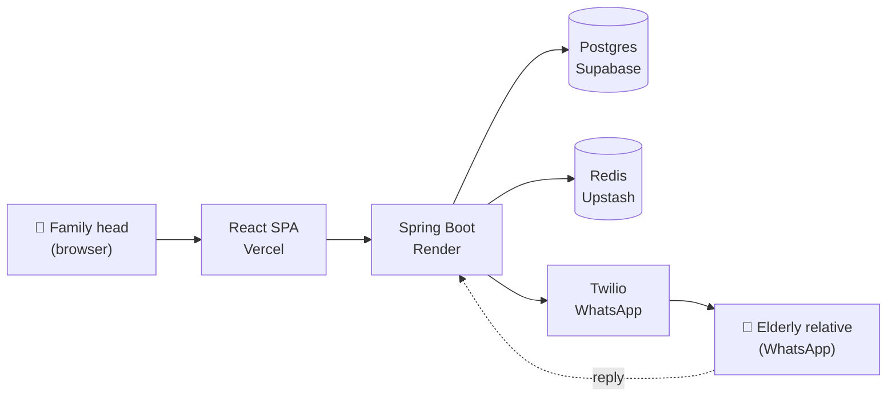

<div align="center">

# 🩺 FamilyCare

### A family health app for India — where the elderly parent never installs a thing.

The tech-savvy daughter sets up medicines, vitals, and emergency contacts on a web dashboard.
Her elderly mother gets WhatsApp reminders on her existing phone. **No app. No login. No friction.**

<br/>

[](https://github.com/patelkarma/familycare/actions)


<br/>

**[🚀 Live demo](https://familycare-gamma.vercel.app)** · **[📘 API docs](https://familycare.onrender.com/swagger-ui.html)** · **[🏛️ Architecture](docs/ARCHITECTURE.md)** · **[🧠 Decisions](docs/DECISIONS.md)**

> ⏱️ Render's free tier sleeps after 15 min idle. First request after wake takes ~30s.

</div>

---

## 📹 Demo

<!--
  Record a 30-45s screen capture and drop the .gif or .mp4 in this section.
  See docs/DEMO_RECORDING.md for the exact 6-shot script.
-->

> _Demo recording in progress — see [`docs/DEMO_RECORDING.md`](docs/DEMO_RECORDING.md) for the 6-shot script._

---

## 🧭 The problem

In India, ~138 million people are aged 60+. The people *managing* their daily health are usually their adult children — who live in a different city, work different hours, and check WhatsApp 50× a day.

**Every existing health app assumes the patient installs it.** The patient is 72. The patient does not install apps.

FamilyCare flips it: the dashboard is for the **caregiver**. The reminders go to **WhatsApp** on the parent's basic phone. Zero install on the device that matters most.

---

## ✨ Features

| | |
|---|---|
| 💊 **Medicine reminders** | Scheduled per family member; delivered via Twilio WhatsApp; escalates to family head if no response in 30 min |
| 📷 **Prescription OCR** | Tesseract + a curated Indian medicine dictionary auto-fills the form from a photo of the prescription |
| 👨‍👩‍👧 **Family dashboard** | Adherence and vitals across every family member in one view, optimistic-UI dose marking |
| 📈 **Vitals trend alerts** | 3 consecutive high-BP / sugar readings auto-escalate to the family head with the actual numbers |
| 📦 **Stock tracker** | Decrements on each dose; low-stock alert with Google Maps pharmacy link |
| 📂 **Medical report locker** | Cloudinary-backed PDF/image storage; pin reports for SOS access |
| 🚨 **One-tap SOS** | WhatsApp blast to all emergency contacts with GPS, blood group, allergies, and active medicines |

---

## 🧠 Notable engineering decisions

The 5 calls I'd want a senior engineer to ask me about — full reasoning in [`docs/DECISIONS.md`](docs/DECISIONS.md).

- **Regex prescription parser, not an LLM.** Sub-millisecond, deterministic, free forever; the regex *fails visibly* while an LLM would fail confidently. Coverage tradeoff documented. ([ADR-004](docs/DECISIONS.md#adr-004-regex-based-prescription-parser-not-an-llm))
- **JWT in `localStorage`, not `httpOnly` cookies.** Cross-origin CORS stays simple, mobile path is identical, XSS risk explicitly mitigated. ([ADR-002](docs/DECISIONS.md#adr-002-jwt-in-localstorage-not-httponly-cookies))
- **Render free tier despite cold starts.** Mitigations (external uptime ping + "waking up" UI state) beat paying. ([ADR-003](docs/DECISIONS.md#adr-003-render-free-tier-despite-cold-starts))
- **Monolith, not microservices.** One engineer × 30 days has a *delivery* problem, not a scaling problem. ([ADR-001](docs/DECISIONS.md#adr-001-one-spring-boot-monolith))
- **WhatsApp-only, not WhatsApp + SMS.** Ship one channel that works over two half-wired ones; Fast2SMS deferred until a real user needs it. ([ADR-005](docs/DECISIONS.md#adr-005-whatsapp-only-reminders-no-sms-fallback-yet))

---

## 📊 By the numbers

- **40 tests** on every push — 14 unit + 2 Testcontainers integration (real Postgres + Redis in Docker) on the backend, 24 Vitest tests on the frontend
- **15 REST controllers** with `@Valid` DTOs, a single `GlobalExceptionHandler`, and JWT-protected by default
- **9 languages** via `react-i18next` — English, हिन्दी, ગુજરાતી, मराठी, বাংলা, தமிழ், తెలుగు, ಕನ್ನಡ, ਪੰਜਾਬੀ — 402 translation keys each, drift-checked in CI
- **5 ADRs** documenting decisions worth defending in a code review
- **1 real production bug** caught by an integration test before it shipped (`/me` returning 500 instead of 401 on missing token — see commit [`bd91a64`](https://github.com/patelkarma/familycare/commit/bd91a64))

---

## 🛠 Tech stack

| Layer | Stack |
|---|---|
| **Backend** | Java 17 · Spring Boot 3.5 · Spring Security + JWT · Spring Data JPA · Tesseract4J · Twilio · Cloudinary · Gemini |
| **Frontend** | React 19 · Vite · TanStack Query · React Hook Form + Zod · Tailwind · Recharts · Tesseract.js · Framer Motion · Leaflet |
| **Data** | PostgreSQL (Supabase) · Redis (Upstash) |
| **Infra** | Render · Vercel · GitHub Actions · Docker · Maven Surefire profiles for unit/integration split |

---

## 🏛 Architecture

A one-page system diagram and the full medicine-reminder lifecycle (Redis-backed delay queue → `@Scheduled` cron → Twilio → optimistic UI → escalation) live in [`docs/ARCHITECTURE.md`](docs/ARCHITECTURE.md).



---

## 🏃 Run it locally

<details>
<summary><b>Click to expand setup instructions</b></summary>

### Prerequisites
- JDK 17+, Node 20+
- Free accounts on Supabase, Upstash, Cloudinary, Twilio Sandbox, Gemini

### Backend
```bash
cd backend
cp .env.example .env   # fill in your values
./mvnw spring-boot:run
```
Boots on `http://localhost:8080`. Swagger at `/swagger-ui.html`.

### Frontend
```bash
cd frontend
cp .env.example .env   # VITE_API_BASE_URL=http://localhost:8080/api
npm install
npm run dev
```
Boots on `http://localhost:5173`.

### Tests
```bash
# Backend (14 unit tests, no Docker required)
cd backend && ./mvnw test

# Backend integration tests (real Postgres + Redis via Testcontainers; needs Docker)
cd backend && ./mvnw test -Pintegration

# Frontend (24 Vitest tests)
cd frontend && npm test
```

</details>

---

## 🗺 Roadmap / what I'd ship next

- Move the prescription parser to **Gemini Vision** once usage justifies the cost — regex covers ~70% of clean inputs but misses handwritten scripts
- Wire **Sentry** on both ends (errors currently disappear into Render logs)
- **Lighthouse CI** gate so the frontend bundle (~1.6 MB) doesn't keep growing
- **Fast2SMS** fallback for users on feature phones without WhatsApp (deferred — see [ADR-005](docs/DECISIONS.md#adr-005-whatsapp-only-reminders-no-sms-fallback-yet))
- **PWA + offline cache** for the dose schedule so reminders work even with patchy 3G

---

## 📄 License

Educational / portfolio project, built solo. Not licensed for redistribution.

<div align="center">
<sub>Built with care for Indian families. ❤️</sub>
</div>
