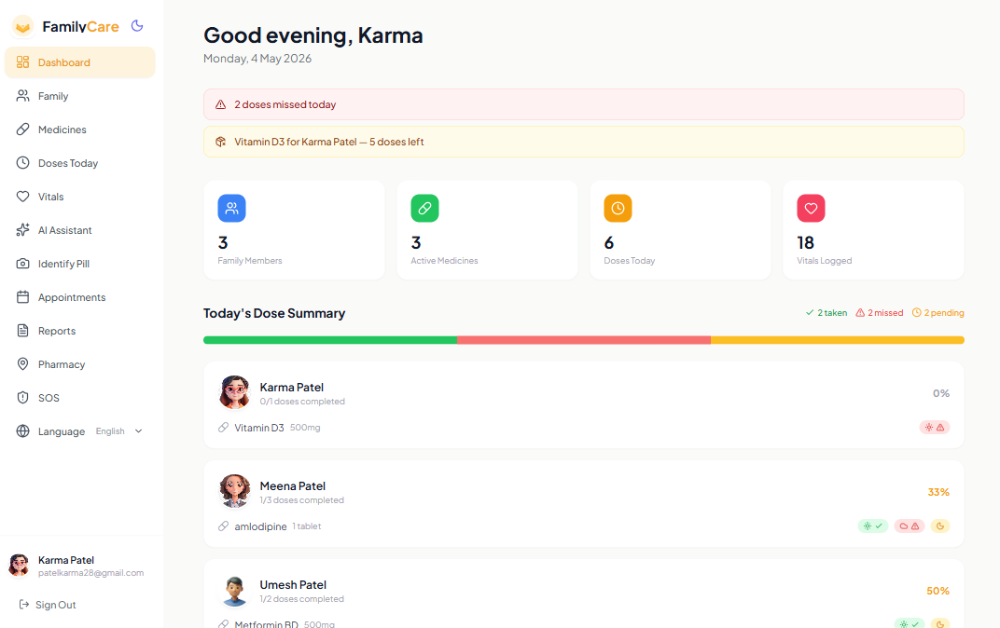
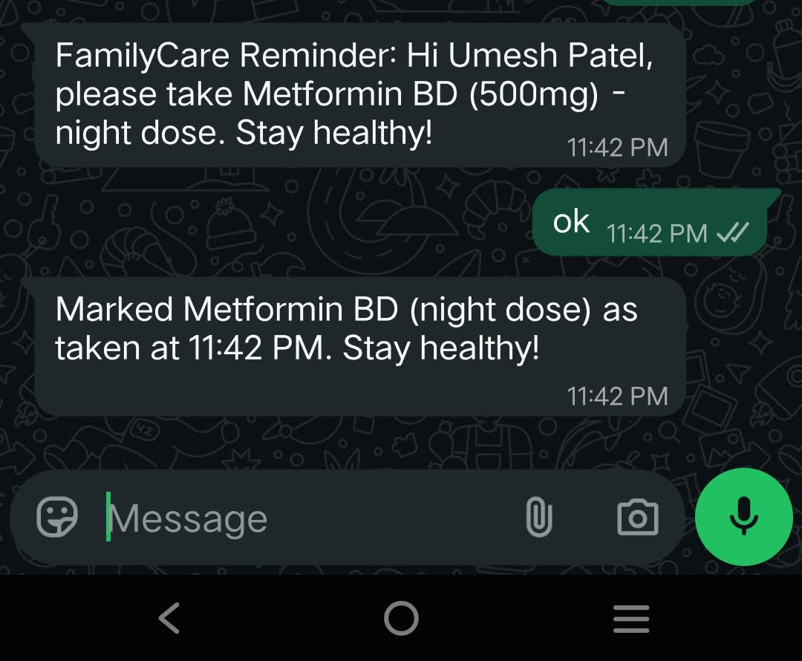
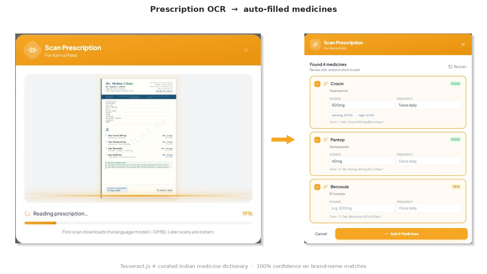
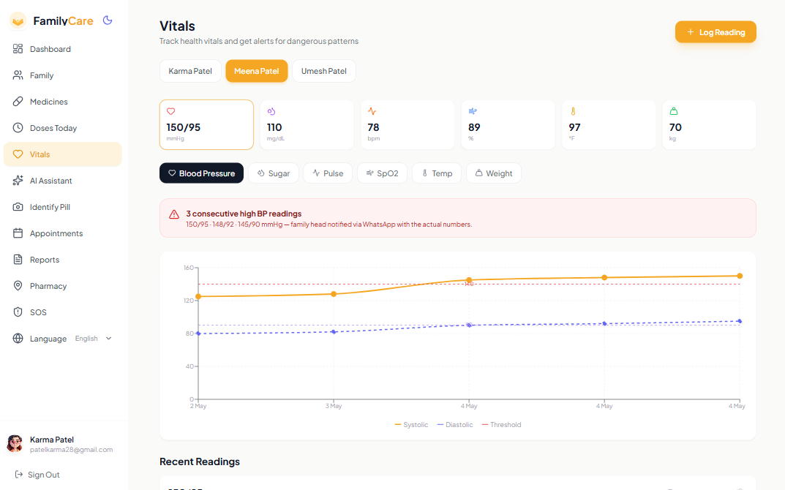
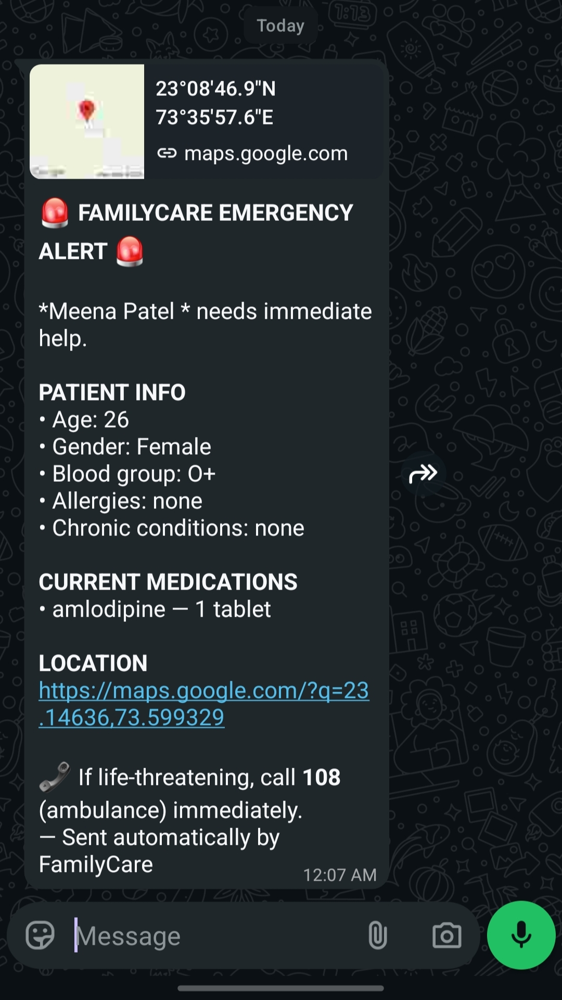
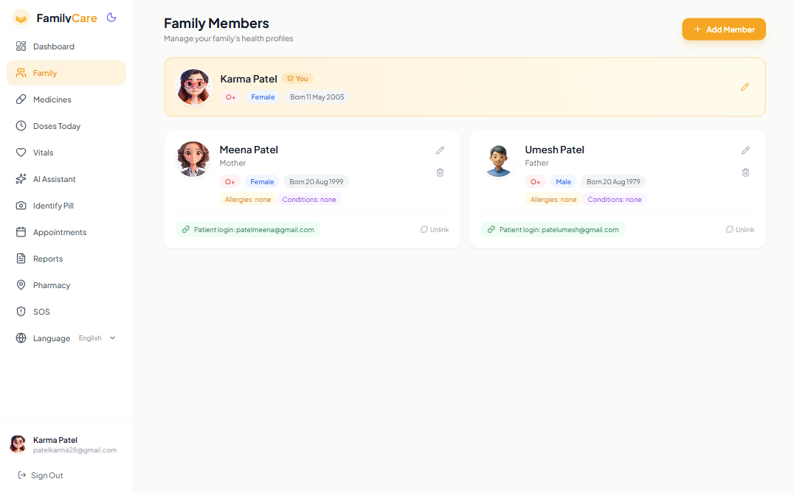
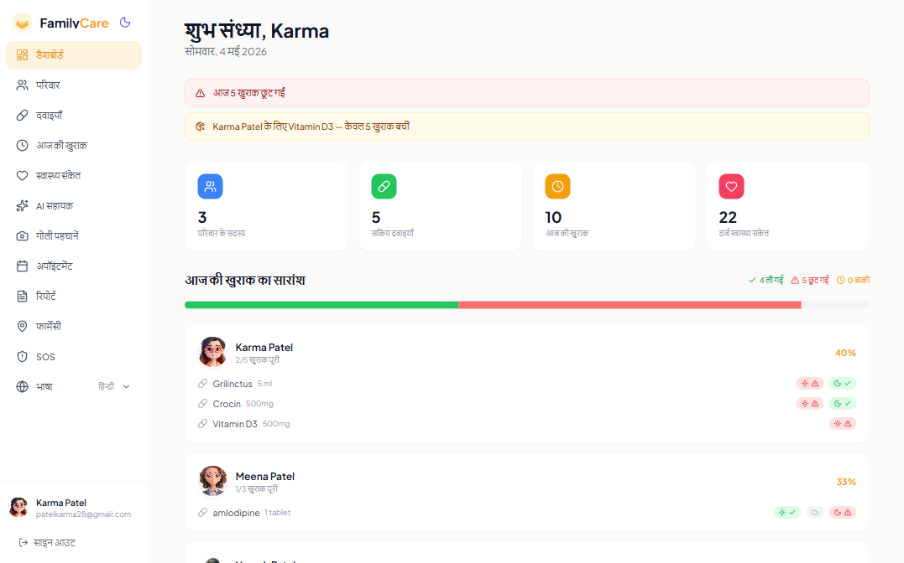
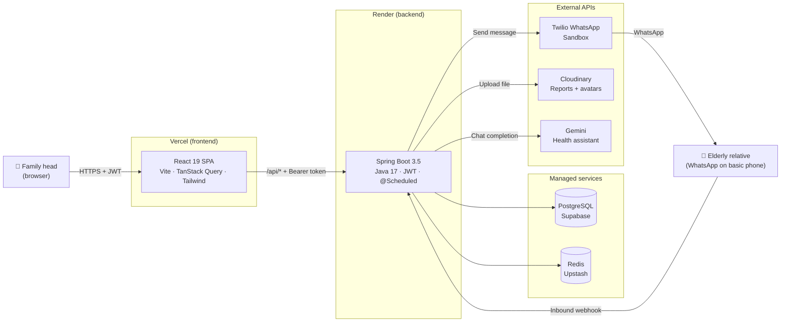

<div align="center">



<br/>

# **FamilyCare** — _the elderly parent never installs a thing._

### **A family-first health management app for India.**
The tech-savvy daughter sets up medicines, vitals, and emergency contacts on a web dashboard.
Her elderly mother gets WhatsApp reminders on her existing phone. **No app. No login. No friction.**

<br/>

[](https://familycare-gamma.vercel.app)
[](https://familycare.onrender.com/swagger-ui.html)
[](https://familycare.onrender.com/api/health)

<br/>

[](https://github.com/patelkarma/familycare/actions)
[](https://github.com/patelkarma/familycare/actions)
[](https://uptimerobot.com)


</div>

---

## 🧭 The problem

In India, ~138 million people are aged 60+. The people *managing* their daily health are usually their adult children — who live in a different city, work different hours, and check WhatsApp 50× a day.

**Every existing health app assumes the patient installs it.** The patient is 72. The patient does not install apps.

FamilyCare flips it: the **dashboard is for the caregiver**. The reminders go to **WhatsApp** on the parent's basic phone. Reply *"ok"*, *"haan"*, or *"✅"* and the dose is marked taken. Zero install on the device that matters most.

> ⚡ **No cold-start wait.** Render's free tier sleeps after 15 min idle. UptimeRobot pings `/api/health` every 5 min so the dyno stays warm — the live demo opens instantly. Reasoning in [ADR-003](docs/DECISIONS.md#adr-003-render-free-tier-despite-cold-starts).

---

## 📸 What it actually looks like

<table>
  <tr>
    <td width="50%"></td>
    <td width="50%"></td>
  </tr>
  <tr>
    <td><b>One dashboard, every member</b><br/>Multi-member family overview with stats tiles, today's dose progress per member, two live alerts (missed dose + low stock), and the Self-vs-managed-member distinction. Built around the caregiver, not the patient.</td>
    <td><b>The thesis in one image</b><br/>Reminder out, lowercase <code>ok</code> reply in (proves the elderly-friendly NLU), confirmation back — round-trip in the same minute. Mom doesn't install an app, doesn't type "TAKEN" in caps, doesn't even reply in English. <code>लिया</code>, <code>kha liya</code>, and <code>👍</code> all work.</td>
  </tr>
  <tr>
    <td></td>
    <td></td>
  </tr>
  <tr>
    <td><b>OCR + curated dictionary, with confidence</b><br/>Tesseract.js extracts text, regex parses dosage/frequency/duration, a 100+ entry Indian medicine dictionary maps brand names to generics. Each detection ships a confidence score (100% exact, 88% fuzzy). The dedup-by-generic + prescription-signal gate kills the 11-false-positives-from-4-real-medicines bug a recruiter would otherwise spot.</td>
    <td><b>Pattern detection, not just charts</b><br/>3 consecutive BP readings ≥ 140 systolic OR ≥ 90 diastolic fires both an in-app red banner AND an outbound WhatsApp alert to the family head with the actual numbers. Same engine handles 2-strike sugar, single-reading pulse + SpO2. Threshold line on the chart shows the rule visually.</td>
  </tr>
  <tr>
    <td></td>
    <td></td>
  </tr>
  <tr>
    <td><b>One tap, four-table aggregation</b><br/>SOS button → backend joins family member + active medicines + emergency contacts + GPS into one WhatsApp blast. Live Google Maps thumbnail + clickable coordinates. Gracefully degrades to "Location unavailable — please call them" when the browser denies geolocation.</td>
    <td><b>Multi-tenant family auth done right</b><br/>One family head manages multiple members. Each member can have their <i>own</i> patient login (separate JWT, scoped to their data only) — useful when an elderly parent's tech-savvy day arrives. Linked accounts show the patient email + an Unlink action. Self member is visually distinct.</td>
  </tr>
  <tr>
    <td></td>
    <td><b>i18n that survives recruiter scrutiny</b><br/>9 Indian languages (English, हिन्दी, ગુજરાતી, मराठी, বাংলা, தமிழ், తెలుగు, ಕನ್ನಡ, ਪੰਜਾਬੀ) × ~408 translation keys, drift-checked in CI. Backend alerts now ship as <code>messageKey + params</code> so plurals like <code>आज 5 खुराक छूट गईं</code> render with correct grammar — not "5 dose missed" stitched into Hindi. The Devanagari date formats locale-aware client-side.</td>
  </tr>
</table>

---

## 🧠 Why this is interesting (the hard problems)

A "real" portfolio piece has to show you can solve problems people actually hit. Five worth opening up the code for:

### 🤖 An NLU that speaks how Indian elders actually text

A naive bot accepts `TAKEN`, `1`, `YES` and rejects everything else. The audience is a 72-year-old on a basic phone — that's the wrong API. `WhatsAppIntentParser` accepts the way mom actually replies:

- **English casual:** `ok`, `okay`, `done`, `finished`, `yeah`, `y`, `1`
- **Hinglish (Latin):** `haan`, `han`, `ji`, `lia`, `liya`, `kha liya`, `khaya`
- **Devanagari:** `हाँ`, `लिया`, `खा लिया`, `खाया` (and `नहीं`, `ना` for skip)
- **Emoji:** `✅`, `✓`, `👍`, `👌`, `💊` (and `❌`, `👎` for skip)

Variation selectors (e.g., `✔️` = `✔` + `U+FE0F`) are stripped before matching so both forms work. Multi-word aliases (`kha liya`) are ordered longest-first in the regex alternation so they don't get split into `kha` + `memberHint=liya`. Locked in by **75 parameterized test cases** covering case variants, languages, and emoji forms.

### 📷 Prescription OCR that doesn't make things up

Tesseract.js + a curated 100+ entry Indian medicine dictionary (Crocin, Pantop, Becosules, Glycomet, Telma, Storvas...). The first pass produced **11 medicines from a 4-medicine prescription** — OCR splits each row into a brand line and a caption line, and both matched independently against the dictionary, so Crocin and its own generic Paracetamol both showed up as separate medicines. Two surgical fixes:

1. **Dedup by `genericName`, not brand.** Crocin and Paracetamol both map to `genericName=Paracetamol`; they collapse into one row, keeping the higher-confidence match.
2. **Prescription-signal gate.** A line must contain at least one of: a form word (Tab/Cap/Syp), a dosage unit (mg/ml), a frequency abbreviation (BD/OD/TDS), or a triplet (1-0-1). Caption lines like *"Paracetamol | After food | Twice daily"* lack all of those, so they don't trigger a match.

Locked in by a [test that feeds the parser the actual OCR output](backend/src/test/java/com/familycare/service/PrescriptionParserTest.java) of the failing prescription and asserts exactly 4 medicines. Future "let me tighten the parser" change can't quietly regress.

### ⏰ Late replies still count

The 30-min watchdog flips a dose to `MISSED` if no reply arrives. Original code rejected late replies with *"already marked as missed."* That's the wrong UX — when a 70-year-old replies "ok" 3 hours after the reminder, they obviously took the medicine. Treating MISSED as non-terminal — accepting `MISSED → TAKEN` and `MISSED → SKIPPED` transitions, plus a fallback in `pickPendingLog` that picks MISSED logs when no PENDING ones remain — closes the loop. The same change relaxed the family-head-can't-race-the-elder block to only fire for *linked* elders (members with their own account), so the head can mark their own Self doses without waiting for a phantom confirmation.

### 🌐 Backend alerts that translate cleanly

The first attempt at i18n had nav labels and tiles in Hindi but alert banners stuck in English: `"3 doses missed today"` was built server-side as a fixed string and shipped as-is. Refactored alerts to send structured data:

```json
{
  "type": "MISSED_DOSE",
  "messageKey": "missedDose",
  "params": { "count": 3 }
}
```

Frontend renders via `t('dashboard.alerts.missedDose', { count: 3 })`, with i18next plural forms (`missedDose_one` / `missedDose_other`) so Hindi reads `आज 3 खुराक छूट गईं` (correct plural) instead of `3 खुराक छूट गई`. Appointment timestamps are passed as ISO strings and formatted client-side so `4 May, 9:00 PM` becomes `4 मई, 9:00 PM` automatically. Drift CI guarantees every locale has every key.

### 🛡 Defensive Unicode in production paths

Diagnosed live via screenshot: the SOS message rendered `*Meena Patel * needs immediate help` with literal asterisks. Cause: a `U+00A0` (non-breaking space) in the stored member name. Java's `String.trim()` and `String.strip()` both ignore the no-break space family. The same character had earlier broken `WHERE name = 'Meena Patel'` SQL. The fix routes all SOS-rendered text through a regex that catches `\s` *and* `\p{Z}` (Unicode SPACE_SEPARATOR), so no future stray paste from a PDF or web form silently breaks the bold formatting in an emergency alert.

### 📜 Every interesting decision has an ADR

| # | Decision | What's interesting |
|---|---|---|
| [001](docs/DECISIONS.md#adr-001-one-spring-boot-monolith) | One Spring Boot monolith | One engineer × 30 days has a *delivery* problem, not a scaling problem |
| [002](docs/DECISIONS.md#adr-002-jwt-in-localstorage-not-httponly-cookies) | JWT in `localStorage`, not cookies | Cross-origin CORS stays simple; mobile path is identical; XSS risk explicitly mitigated |
| [003](docs/DECISIONS.md#adr-003-render-free-tier-despite-cold-starts) | Render free tier despite cold starts | UptimeRobot ping + warning banner beats $7/mo for a portfolio project |
| [004](docs/DECISIONS.md#adr-004-regex-based-prescription-parser-not-an-llm) | Regex parser, not an LLM | Deterministic, free, *fails visibly*; LLM parser hallucinates with confidence |
| [005](docs/DECISIONS.md#adr-005-whatsapp-only-reminders-no-sms-fallback-yet) | WhatsApp-only, not WhatsApp + SMS | Ship one channel that works over two half-wired ones |

---

## 📊 By the numbers

- **114 tests** run on every push — 90 backend (JUnit 5 + Mockito + Testcontainers Postgres + Redis) + 24 frontend (Vitest + Testing Library + jsdom)
- **15 REST controllers** with `@Valid` DTOs, a single `GlobalExceptionHandler`, and JWT-protected by default
- **9 languages × ~408 translation keys** — drift-checked in CI; alerts include i18next plural forms
- **5 ADRs** documenting decisions worth defending in a code review
- **6 real production bugs** found and fixed live during development:
  - `/me` endpoint returning 500 instead of 401 ([`bd91a64`](https://github.com/patelkarma/familycare/commit/bd91a64)) — caught by the integration test before it shipped
  - Springdoc 2.6.0 `NoSuchMethodError` on Spring Boot 3.5 prod ([`72b51f6`](https://github.com/patelkarma/familycare/commit/72b51f6))
  - OCR returning 11 medicines from a 4-medicine prescription ([`cc5b121`](https://github.com/patelkarma/familycare/commit/cc5b121))
  - Lambda capture compile error caught by Render's clean build ([`7f1135b`](https://github.com/patelkarma/familycare/commit/7f1135b))
  - NBSP in member names breaking SQL `WHERE` clauses and WhatsApp bold formatting ([`c1728db`](https://github.com/patelkarma/familycare/commit/c1728db))
  - Vercel SPA refresh 404 (`/dashboard` reload returned `NOT_FOUND`) ([`590260a`](https://github.com/patelkarma/familycare/commit/590260a))

---

## 🛠 Tech stack

| Layer | Choice | Why it's there |
|---|---|---|
| **Backend** | Java 17 · Spring Boot 3.5 · Spring Security + JWT · Spring Data JPA · `@Scheduled` | Stateless, mature, security-first, hireable |
| **Frontend** | React 19 · Vite · TanStack Query · React Hook Form + Zod · Tailwind 3 · Recharts · Framer Motion · Leaflet | Modern, distinctive design system, polished animations |
| **DB** | PostgreSQL on Supabase | 500 MB free, ACID, real prod-grade DB |
| **Cache / queue** | Redis on Upstash | `@Scheduled` cron pops due reminder jobs from a Redis-backed delay queue |
| **OCR** | Tesseract.js (browser) + curated Indian medicine dictionary | Free; runs entirely client-side; deterministic; falls visibly when unsure |
| **WhatsApp** | Twilio sandbox (outbound + inbound webhook) | Production-grade messaging with per-message delivery receipts |
| **File storage** | Cloudinary | Direct browser upload via signed preset; API never sees the bytes |
| **AI assistant** | Google Gemini | Free tier; vendor-isolated behind a service interface |
| **API docs** | Springdoc OpenAPI / Swagger UI | Auto-generated, browsable, recruiter-shareable |
| **i18n** | i18next 26 + 9 locale files + drift test in CI | Plural forms (`_one`/`_other`), interpolation, locale-aware date formatting |
| **Validation** | Jakarta Bean Validation (`@Valid` + `@NotBlank` + custom messages) | Field-level error envelope from `GlobalExceptionHandler` |
| **Tests** | JUnit 5 + Mockito + AssertJ + **Testcontainers** for Postgres + Redis · Vitest + Testing Library | Real DB integration tests in CI; not H2 fakes |
| **CI/CD** | GitHub Actions · Vercel auto-deploy · Render auto-deploy on `main` | Every green push lands in prod |
| **Hosting** | Vercel (FE) · Render (BE) · Supabase (Postgres) · Upstash (Redis) · Cloudinary (files) | All free tier — zero-cost demo story |
| **Uptime** | UptimeRobot pinging `/api/health` every 5 min | Keeps the Render free tier warm; first-request latency stays low |

---

## 🏛 Architecture



The full reminder lifecycle (Redis-staged jobs → minutely cron → Twilio → inbound webhook → DB update → low-stock cascade) is documented in [`docs/ARCHITECTURE.md`](docs/ARCHITECTURE.md) with the sequence diagram.

---

## 🏃 Run it locally

<details>
<summary><b>Click to expand setup</b></summary>

### Prerequisites
- JDK 17+, Node 20+, Docker (for the Testcontainers integration tests only — unit tests don't need it)
- Free accounts on Supabase, Upstash, Cloudinary, Twilio sandbox, Gemini

### Backend
```bash
cd backend
cp .env.example .env       # fill in real values
./mvnw spring-boot:run
```
Boots on `http://localhost:8080`. Swagger at `/swagger-ui.html`.

### Frontend
```bash
cd frontend
cp .env.example .env       # VITE_API_BASE_URL=http://localhost:8080
npm install
npm run dev
```
Boots on `http://localhost:5173`.

### Tests
```bash
# Backend unit tests (90 tests, no Docker needed)
cd backend && ./mvnw test

# Backend integration tests (real Postgres + Redis via Testcontainers; needs Docker)
cd backend && ./mvnw verify -Pintegration

# Frontend (24 Vitest tests including i18n drift check)
cd frontend && npm test
```

</details>

---

## 🗺 What I'd ship next

- **Fast2SMS fallback** for users on feature phones without WhatsApp ([ADR-005](docs/DECISIONS.md#adr-005-whatsapp-only-reminders-no-sms-fallback-yet))
- **Move the prescription parser to Gemini Vision** once usage justifies the cost — regex covers ~70% of clean inputs but misses handwritten scripts
- **Sentry on both ends** — errors currently disappear into Render logs
- **Lighthouse CI gate** so the frontend bundle (~1.6 MB) doesn't keep growing
- **PWA + offline cache** for the dose schedule so reminders work even with patchy 3G
- **Push notifications via FCM** as a complement to WhatsApp for users who *do* install

---

## 💭 What I learned building this

### On talking to humans
- "TAKEN" is what a developer types. "ok", "lia", "✅", "खा लिया" is what an elderly mother actually sends. The matcher is the product.
- Late replies are the rule, not the exception. Treating `MISSED` as terminal locks out the user at exactly the moment they're trying to do the right thing.
- The fallback message is the feature. *"Location unavailable — please call them to confirm"* tells the recipient what to do next; *no location at all* leaves them lost.

### On hidden complexity
- A non-breaking space (`U+00A0`) silently broke a SQL `WHERE`, then silently broke WhatsApp bold formatting. Java's `trim()` and `strip()` both ignore it. The fix is one regex but the lesson is wider — *always normalize Unicode at trust boundaries*.
- Lambda variable capture rejects reassignment. Local incremental compiles silently slip past it; only a clean build catches it. After this, I run `./mvnw clean compile` before pushing changes that touch lambda capture sites.
- Vercel's SPA routing 404s on `/dashboard` refresh unless you ship a `vercel.json` rewrite. Easy to miss because dev-mode routing works fine.

### On honest engineering
- A regex parser that handles 70% reliably and *fails visibly* on the rest beats an LLM parser that confidently hallucinates the 30%. Document the seam (`PrescriptionParser.parse`) so swapping is one class change when the cost equation flips.
- Render's free tier sleeping after 15 min idle isn't a bug to hide — it's a constraint to mitigate. UptimeRobot for $0 is a better answer than $7/mo until a real user complains.
- Every interesting decision deserves an ADR. *Why we didn't pick microservices* is more useful in code review than the architecture itself.

---

## 📄 License

Educational / portfolio project, built solo. Not licensed for redistribution.

<div align="center">
<sub>Built with care for Indian families. ❤️</sub>
<br/>
<sub>If you read this far and you're hiring for backend / full-stack roles in India — <a href="https://github.com/patelkarma">say hi</a>.</sub>
</div>
