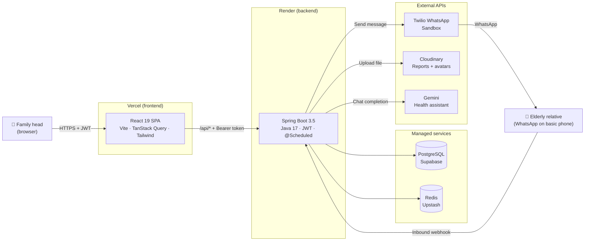
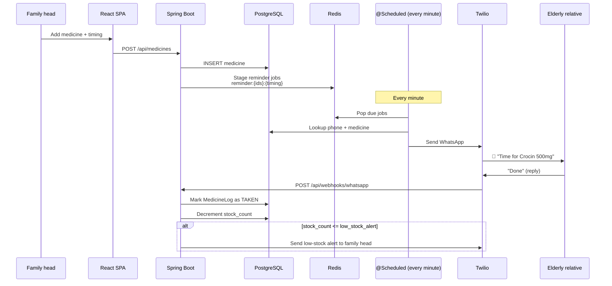

# Architecture

A high-level view of how the pieces fit together. For why each piece was chosen, see [DECISIONS.md](./DECISIONS.md).

## System diagram



## Request lifecycle: medicine reminder



## Layered structure (backend)

```
┌──────────────────────────────────────┐
│  Controller   ← REST + DTO mapping   │  @RestController, @Valid
├──────────────────────────────────────┤
│  Service      ← business logic       │  @Service, @Transactional
├──────────────────────────────────────┤
│  Repository   ← data access          │  Spring Data JPA
├──────────────────────────────────────┤
│  Model        ← JPA entities         │  @Entity
└──────────────────────────────────────┘
```

Cross-cutting:
- `JwtFilter` runs before every authenticated request
- `GlobalExceptionHandler` translates domain exceptions to HTTP status codes
- `@Scheduled` jobs run on a separate thread pool, isolated from the request path

## Why this shape

- **Stateless API + JWT** so Render can scale horizontally and free-tier sleeps don't drop sessions.
- **Redis as a delay queue** instead of a job framework (Quartz/Temporal) — the cron is one minute; complexity isn't justified.
- **Frontend-only PDF/image uploads** go straight to Cloudinary with a signed preset; the API never sees the bytes. Saves Render bandwidth.
- **One Spring Boot app, no microservices.** A 30-day project doesn't have a microservice problem.

## What's deliberately *not* here

- No service mesh, no Kafka, no GraphQL — see [DECISIONS.md](./DECISIONS.md) for why.
- No SMS fallback yet — WhatsApp via Twilio sandbox covers the demo. Fast2SMS is on the roadmap.
- No real-time push from server to SPA. WebSocket would be overkill for the dose update cadence.
